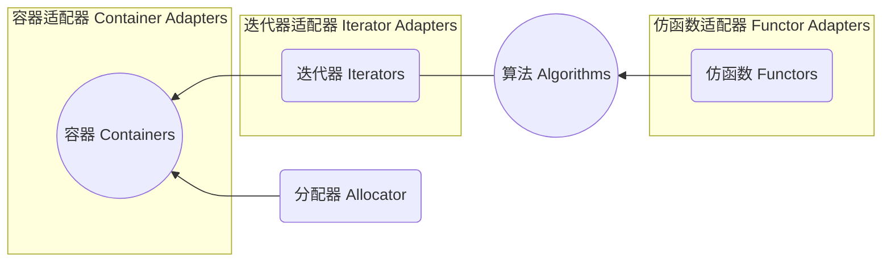
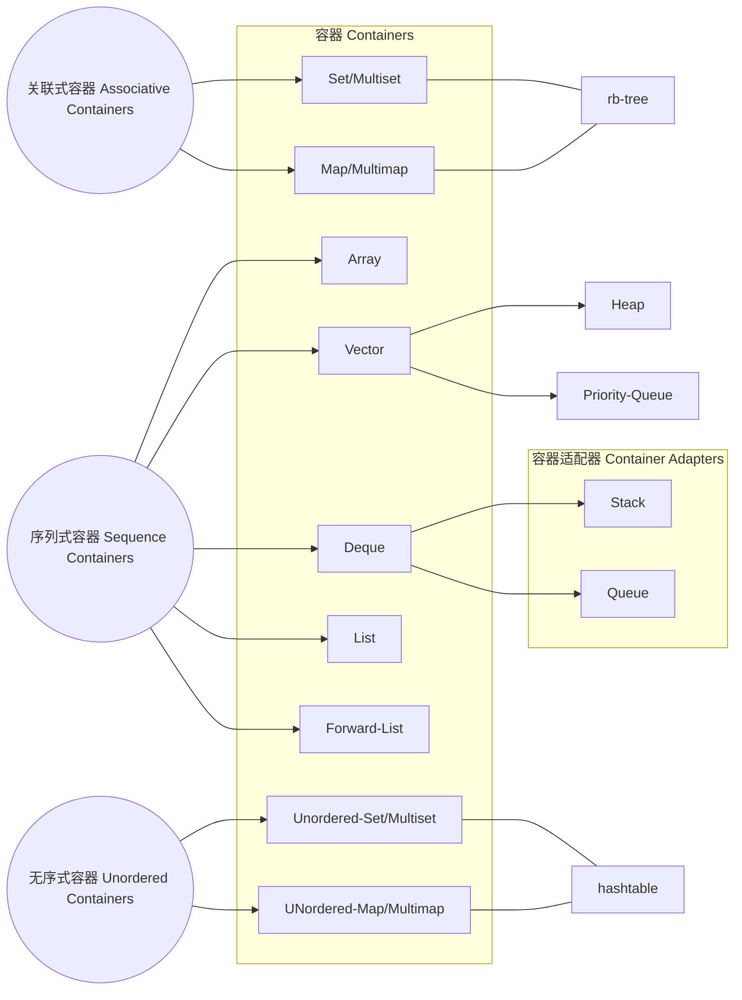
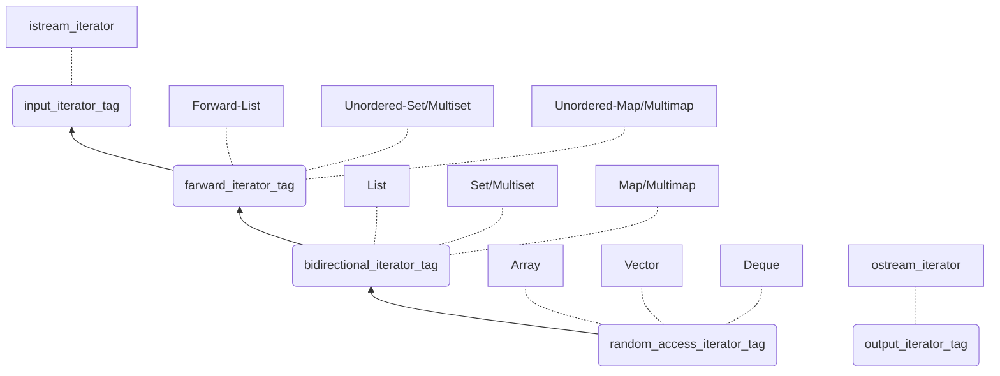
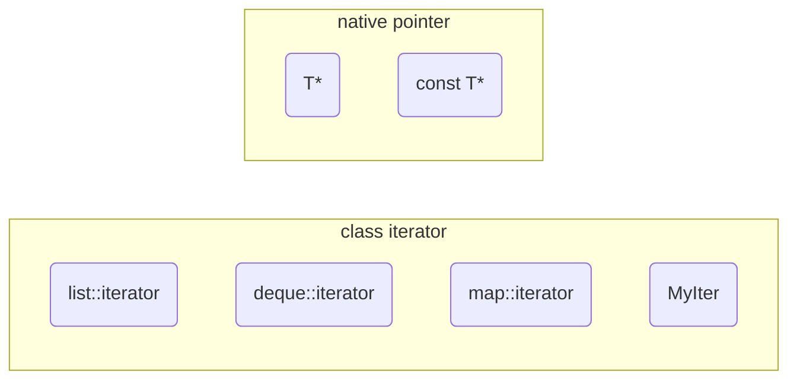
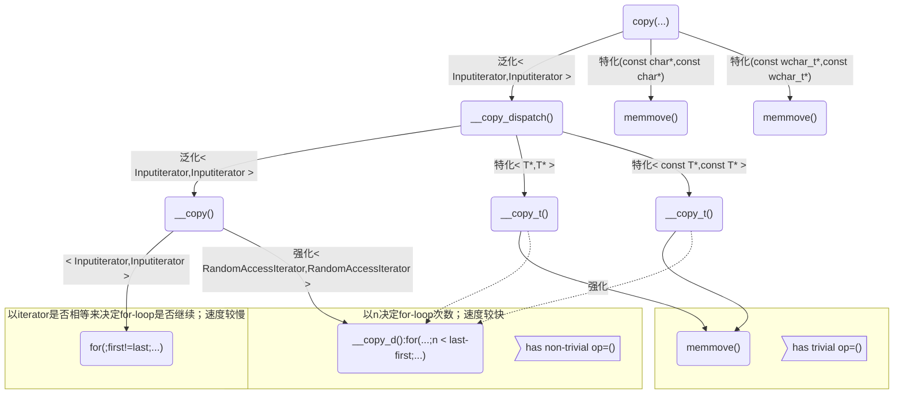
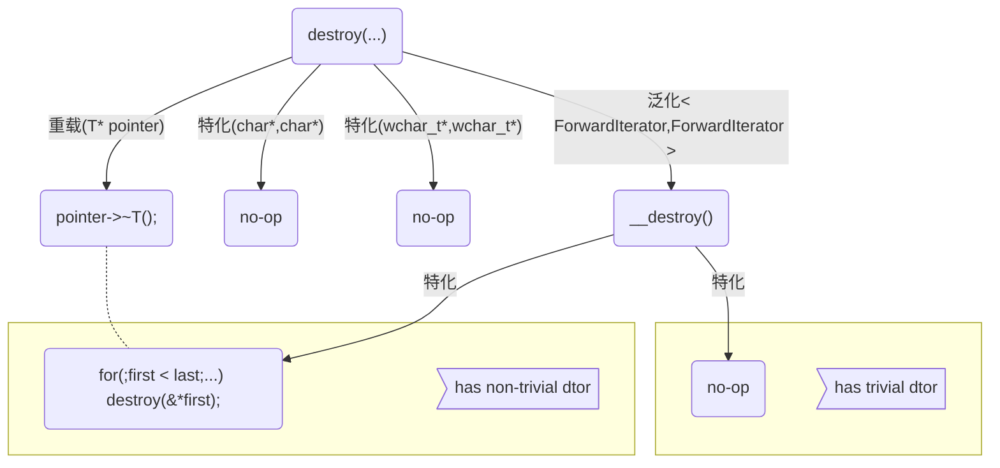
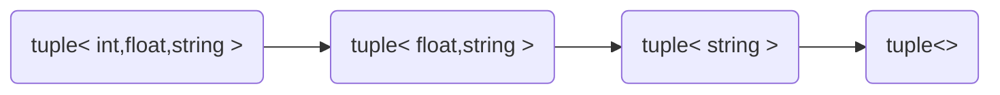

## C++STL标准库和泛型编程笔记 ##


```cpp
#include <vector>
#include <algorithm>
#include <functional>
#include <iostream>

using namespace std;

int main()
{
    int ia[6] = { 27, 210, 12, 47, 109, 83 };
    vector<int,allocator<int>/*allocator*/>/*containers*/ vi(ia, ia+6);
	
    cout << count_if/*algorithm*/(vi.begin(), vi.end(),
				  not1/*function adapter(negator)*/(bind2nd/*function adapter(binder)*/(less<int>()/*function object*/, 40)));

    return 0;
}
```
从语言层面讲：  
* 容器Container是个class template
* 算法Algorithm是个function template
* 迭代器Iterator是个class template
* 仿函数Functor是个class template
* 适配器Adapter是个class template
* 分配器Allocator是个class template

各种容器的iterators的iterator_category：
```cpp
// 五种iterator_category
struct input_iterator_tag {};
struct output_iterator_tag {};
struct forward_iterator_tag : public input_iterator_tag {};
struct bidirectional_iterator_tag : public forward_iterator_tag {};
struct random_access_iterator_tag : public bidirectional_iterator_tag {};
```


----
1. 目前常见的Big-oh有下列几种情形：
* $O(1)$或$O(c)$：称为常数时间(constant time)
* $O(n)$：称为线性时间(linear time)
* $O(log_2n)$：称为次线性时间(sub-linear time)
* $O(n^2)$：称为平方时间(quadratic time)
* $O(n^3)$：称为立方时间(cubic time)
* $O(2^n)$：称为指数时间(exponential time)
* $O(nlog_2n)$：介于线性及二次方成长的中间之行为模式

2. 容器迭代器是前闭后开，即`c.begin()`指向第一个元素，`c.end()`指向最后一个元素的下一个位置  
所有容器都维护着两个迭代器，start指向头，finish指向尾

3. 容器－结构与分类
* Sequence Containers:
    * Array(C++11)
	* Vector
	* Deque
	* List
	* Forward-List(C++11)
* Associative Containers:
    * Set/Multiset
	* Map/Multimap
* Unordered Containers(HashTable Separate Chaining实现)(C++11)
    * Unordered Set/Multiset
	* UNordered Map/Multimap

List：环状双向链表；Forward-List：单向链表
Set ：一个值； Map ：一个 key ，一个value  
Multiset/Multimap：放的元素可以重复

4. vector的成长是在另一个位置开辟空间并移动过去，每次成长会调用大量拷贝构造函数

5. list的`max_size()`？

6. forward_list只有`push_front()`,并且无`back()`和`size()`

7. stack和queue不提供iterator

8. map可以用`[]`做insertion，multimap不可以

9. unordered_multiset有`bucket_count()`可以取得hashtable的篮子数，`bucket_size()`可以获得篮子内元素数量

10. OOP将datas和methods联系在一起，而GP将datas和methods分开来
* Containers和Algorithms团队可各自闭门造车，其间以Iterator沟通即可
* Algorithms通过Iterators确定操作范围，Iterators取用Container元素

11. 为什么list不能使用`::sort()`排序？  
因为 list 不支持随机访问（vector和deque可以）

```cpp
template <class RandomAccessIterator>
inline void sort<Randomaccessiterator first, Randomaccessiterator last) {
    if (first != last) {
	__introsort_loop(first, last, value_type(first),
			 __lg(last - first) * 2);
	__final_insertion_sort(first, last);
    }
}

template <class Randomaccessiterator, class T, class Size>
void __introsort_loop(Randomaccessiterator first, Randomaccessiterator last,
		      T *, Size depth_limit) {
...
    Randomaccessiterator cut = __unordered_partition(
	first, last,
	T(__median(*first, *first(first + (last - first) / 2), *(last - 1))));
    //只有Randomaccessiterator才能如此操作
...
}
```

12. 模板参数可以是函数类型？——不可以，除非是函数指针  
仿函数和函数指针在调用时很类似，但在创建上有区别，且仿函数在类型中包含了函数实现，而函数指针类型不包含函数实现；函数模板会自动推导模板形参，所以传函数或者仿函数都可以，它会自动推导类型为函数指针或者类

模板参数的类型：  
* 类型形参
* 非类型形参
    * 非类型模板形参：模板的非类型形参也就是内置类型形参，如`template<class T, int a> class B{};`其中`int a`就是非类型的模板形参。
    * 非类型形参在模板定义的内部是常量值，也就是说非类型形参在模板的内部是常量。
    * 非类型模板的形参只能是整型，指针和引用，像`double`，`String`, `String **`这样的类型是不允许的。但是`double &`，`double *`，对象的引用或指针是正确的。
    * 调用非类型模板形参的实参必须是一个常量表达式，即他必须能在编译时计算出结果。
    * 注意：任何局部对象，局部变量，局部对象的地址，局部变量的地址都不是一个常量表达式，都不能用作非类型模板形参的实参。全局指针类型，全局变量，全局对象也不是一个常量表达式，不能用作非类型模板形参的实参。
    * 全局变量的地址或引用，全局对象的地址或引用`const`类型变量是常量表达式，可以用作非类型模板形参的实参。
    * `sizeof`表达式的结果是一个常量表达式，也能用作非类型模板形参的实参。
    * 当模板的形参是整型时调用该模板时的实参必须是整型的，且在编译期间是常量，比如`template <class T, int a> class A{};`如果有`int b`，这时`A<int, b> m;`将出错，因为b不是常量，如果`const int b`，这时`A<int, b> m;`就是正确的，因为这时`b`是常量。
    * 非类型形参一般不应用于函数模板中，比如有函数模板`template<class T, int a> void h(T b){}`，若使用`h(2)`调用会出现无法为非类型形参`a`推演出参数的错误，对这种模板函数可以用显示模板实参来解决，如用`h<int, 3>(2)`这样就把非类型形参`a`设置为整数。

13. [操作符重载](http://en.cppreference.com/w/cpp/language/operators)

| Expression | As member function | As non-member function | Example |
| ---- | ---- | ---- | ---- |
| @a | (a).operator@ ( ) | operator@ (a) | `!std::cin` calls `std::cin.operator!()` |
| a@b | (a).operator@ (b) | operator@ (a, b) | `std::cout << 42` calls `std::cout.operator<<(42)` |
| a=b | (a).operator= (b) | **cannot be non-member** | Given `std::string s;`, `s = "abc";` calls `s.operator=("abc")` |
| a(b...) | (a).operator()(b...) | **cannot be non-member** | Given `std::random_device r;`, `auto n = r();` calls `r.operator()()` |
| a[b] | (a).operator[](b) | **cannot be non-member** | Given `std::map<int, int> m;`, `m[1] = 2;` calls `m.operator[](1)` |
|a-> | (a).operator-> ( ) | **cannot be non-member** | Given `std::unique_ptr<S> p;`, `p->bar()` calls `p.operator->()` |
| a@ | (a).operator@ (0) | operator@ (a, 0) | Given `std::vector<int>::iterator i;`, `i++` calls `i.operator++(0)` |

注意：`operator!=()`也可以重载

14. `vector<bool>`并不是stl容器，因为`operator[]`无法返回一个对应元素的引用：
```cpp
vector<bool> c{ false, true, false, true, false }; 
bool b = c[0]; 
auto d = c[0]; //d的类型不是bool，而是vector<bool>中的一个内部类 
```

15. 当模板范围偏特化定义冲突时，怎么选择？  
答：选择最特化版本  
同时，当函数重载调用冲突时，怎么选择？  
答：同样选择最特化版本  

```cpp
template <typename T> 
struct S
{
    S() { cout << "T" << endl; }
};

template <typename T> 
struct S<T*> 
{
    S() { cout << "T*" << endl; }
};

template <typename T> 
struct S<vector<T>*> 
{
    S() { cout << "vector<T>*" << endl; }
};

main()
{
    S<vector<int>*> obj;
}
```

16. 函数模板不需要偏特化，是因为函数可以重载；而类不能重载（模板参数数量不同也不行）  
类只能有一个以及它的特化或偏特化们
> C++标准规定，函数模板不能偏特化  
函数模板的特化并不参与重载决议  
非模板函数是C++的一等公民  
如果编译器没有发现合适的一等公民， 那么主函数模板作为C++中的二等公民被纳入考虑  
如果还不能选出唯一的主函数模板，编译器会根据一组相当晦涩的规则确定出那个主函数模板是最特化的  
函数模板特化并不参与重载决议.只有在某个主模板被重载的决议前提下,其特化版本才有可能被使用.而且编译器在选择住模板的时候并不关心他是否有某个特化版本.  
如果你想要将一个主模板特化,同时又希望该特化版本能够参与重载决议, 只需将其写成普通函数. 如果你确实提供了某个函数模板的重载,那么你应该避免为他提供特化.  
如果你正在写一个可能需要被特化的主函数模板的话,请尽量将它写成一个孤立的,永远不该被特化或重载的函数模板, 并将其具体实现全部放入一个包含了一个静态函数的类模板当中, 这么一来任何人都可以对后者进行特化(包括偏特化), 而同时又不会影响到主函数模板的重载决议.

> `allocator<int>().allocate()`：获取临时对象并调用其方法 

17. 在类中欲调用与类中成员函数同名的全局函数时，可以用`::Foo()`

18. 分配器allocators(GNU C __pool_alloc)中可以实现内存池以避免零散内存申请的开销（例如：维护一个数组，其每个元素是某个大小内存块的数组，用单向链表串起来）

19. `operators++`重载有两个：
* 前置型(prefix form):`++i`  
`self& operator++() { node = (link_type)((*node).next); return *this; }`
* 后置型(postfix form):`i++`  
`self operator++(int) { self tmp = *this; ++*this; return tmp; }`（后参数无意义）  
其中`self tmp = *this`不会调用`operator*`，而会先调用copy ctor：`__list_iterator(const iterator& x) : node(x.node) {}`，因为`*this`已经被解释为ctor的参数  
同样，`++*this`不会调用`operator*`，而会先调用`operator++()`，因为`*this`已经被解释为`operator++`的参数

```cpp
int i(6);
++++i; -> ++(++i); //允许
i++++; -> (i++)++; //不允许
```

20. list容器刻意在尾部加一个空白节点供`end()`指向，以符合STL的前闭后开

21. `typename`+类型来声明其为一个类型而非变量，即嵌套从属类型名称需要用typename声明
```cpp
template<typename T>
void fun(const T& proto){
	//T::const_iterator it(proto.begin()); //无法通过编译
	typename T::const_iterator it(proto.begin());
}
```

22. 普通函数通过参数类型来约束传入的参数，并通过虚函数实现运行时多态；模板函数通过函数体来约束传入的参数类型（可传入，但函数体可能编译不过），实现编译时多态（模板可以打破类型约束，到编译时确定）

23. iterator必须提供5种associated types
```cpp
template<typename _Tp>
struct _List_iterator
{
	typedef std::bidirectional_iterator_tag
	                  iterator_category; //(1)（迭代器类型）
	typedef           _Tp valu_type;     //(2)
	typedef _Tp*      pointer;           //(3)
	typedef _Tp&      reference;         //(4)
	typedef ptrdiff_t difference_type;   //(5)（衡量距离的类型）
};
```

24.Traits（萃取机）：  
这个traits机器必须有能力分辨它所获得的iterator是  
(1)class iterator T:  
直接问：
```cpp
I::iterator_category;
I::pointer;
I::reference;
I::value_type;
I::difference_type;
```
(2)native pointer to T:  
利用partial specialization（范围偏特化）可达到目标  
```cpp
template <class I>
struct iterator_traits { // traits是特性之意
    typedef typename I::value_type value_type;
};

// 两个partial specialization：
template <class T>
struct iterator_traits<T*> { // pointer to T
    typedef T value_type;
};
template <class T>
struct iterator_traits<const T*> { // pointer to const T
    typedef T value_type; //注意是T而不是const T
};

template <typename I, ...>
void algorithm(...) {
    typename iterator_traits<I>::value_type v1;
}
```
由此想到：偏特化机制可用于编译期分类

由此可见：迭代器本质是指针或者模仿指针的类（当算法使用裸指针迭代器时，记得end是最后一个元素的下一个元素，即前闭后开）

PS：解决计算机问题的尚方宝剑：加一个中介层

25. vector的迭代器不是一个class，本质就是指针typedef的(GNU C 2.9)
```cpp
template<class T,class Alloc = alloc>
class vector {
public:
    typedef T value_type;
    typedef value_type* iterator; //T*
...
}
```
连续空间的迭代器不需要单独设计类来实现，只需要指针

26. array本质就是数组，包装成容器是为了能够使用stl算法
```cpp
template <typename _Tp, std::size_t _Nm>
struct array
{
    typedef _Tp         value_type;
    typedef _Tp*        pointer;
    typedef value_type* iterator;

    // Support for zero-sized arrays mandatory
    value_type _M_instance[_Nm ? _Nm : 1];

    iterator begin()
    { return iterator(&_M_instance[0]); }

    iterator end()
    { return iterator(&_M_instance[_Nm]); }
	
	...
};
```
array没有ctor，没有dtor  
```cpp
typedef int T[100];
T c;
```

27. deque双向扩充的原理  
iterator: cur | first | last | node  
当deque迭代器走到buffer边界时需要有相关处理  
（GNU C 2.9）deque的BufSiz：`template <class T, class Alloc=alloc, size_t BufSiz=0>`默认为0  
```cpp
// 如果n不为0，传回n，表示buffer size由使用者自定
// 如果n为0，表示buffer size使用预设值，那么
//   如果sz（sizeof(value_type)）小于512,传回512/sz，
//   如果sz不小于512,传回1
inline size_t __deque_buf_size(size_t n,size_t sz)
{
	return n!=0?n:(sz<512?size_t(512/sz):size_t(1));
}
```
deque iterator的相减
```cpp
//两根iterators之间的距离想当于
//(1)两根iterators间的buffers的总长度＋
//(2)itr至其buffer末尾的长度＋
//(3)x至其buffer起头的长度
difference_type
operator-(const self& x) const
{
	return difference_type(buffer_size()) * (node - x.node - 1) + 
	(cur - first)/*末尾（当前）buffers的元素量*/ + (x.last - x.cur)/*起始buffer的元素量*/;
}
```
deque为模拟连续空间，重载了`operator+=`、`operator+`、`operator-=`、`operator-`、`operator[]`  
deque扩充控制中心时会发生拷贝，会将原数据拷贝到新空间的中段，方便左右扩充  
stack 和 queue 默认内部有个 deque ，二者不像容器更像适配器，且都不允许遍历，也不提供 iterator ； stack 和 queue 都可以选择 list 作为内部容器，但只有stack可以选择vector作为内部容器而queue不可以；二者都不可以选择set或者map作为内部容器

28. vector、list、deque提供的操作名是统一的：`push_front()`、`pop_front()`、`push_back()`、`pop_back()`、`front`、`back()`

29. 对于模板类，没有调用到的成员函数就不会去编译检查正确性

30.rb_tree提供“遍历”操作及iterators  
我们不应使用rb_tree的iterators改变元素值（因为元素有其严谨的排列规则）；编程层面(programming level)**并未阻绝此事**；如此设计是正确的，因为rb_tree即将为set和map服务（作为其底部支持），而map允许元素的data被改变，只有元素的key才是不可改变的  
rb_tree提供两种insertion操作：`insert_unique()`和`insert_equal()`；前者表示节点的key一定在整个tree中独一无二，否则按插失败；后者表示节点的key可以重复
```cpp
template <class Key, 
		class Value, // key+data，data可能是一包东西 
		class KeyOfValue, // 如何从value中拿到key 
		class Compare, // 如何比较key的大小，是一个仿函数
        class Alloc = alloc>
class rb_tree {
...
};
```
rb_tree有一个header，没放真正的元素，左指针指向树的最左边元素，右指针指向树的最右边元素

31. GNU C++独有仿函数
* identity：用于获得元素自身的仿函数
```cpp
template <class T>
struct identity : public unary_function<T,T> {
	const T& operator()(const T& x) const { return x; }
};
```
* select1st：用于返回pair的first元素的仿函数
```cpp
template <class Pair>
struct select1st :
	public unary_function<Pair, typename Pair::first_type> {
	const typename Pair::first_type&
	operator()(const Pair& x) const
	{ return x.first; }
};
```
* select2nd：用于返回pair的second元素的仿函数
```cpp
template <class Pair>
struct select2nd :
    public unary_function<Pair, typename Pair::second_type> {
    const typename Pair::second_type&
    operator()(const Pair &x) const
    { return x.second; }
};
```

32. less：自带的`<`比大小的仿函数
```cpp
template <class T>
struct less : public binary_function<T, T, bool> {
	bool operator()(const T& x, const T& y) const
	{ return x < y; }
};
```

33. 我们**无法**使用set/multiset的iterators改变元素值（因为key有其严谨的排列规则）；set/multiset的iterator是其底部的RB tree的const_iterator，就是为了**禁止**user对元素赋值  
set调用rb_tree的`insert_unique()`  
multiset调用rb_tree的`insert_equal()`

34. 我们**无法**使用map/multimap的iterators改变元素值（因为key有其严谨的排列规则）；但可以用它来改变元素的data；因此map/multimap内部自动将user指定的key type设为const，如此便能禁止user对元素的key赋值
map调用rb_tree的`insert_unique()`  
multimap调用rb_tree的`insert_equal()`
```cpp
template <class Key, 
		class T, 
		class Compare = less<Key>, 
		class Alloc = alloc>
class map {
public:
  typedef Key key_type;
  typedef T data_type;
  typedef T mapped_type;
  typedef pair<const Key, T> value_type; // key被设置成const
  typedef Compare key_compare;
private:
  typedef rb_tree<key_type, value_type, 
                  select1st<value_type>, key_compare, Alloc> rep_type;
  rep_type t;
public:
  typedef typename rep_type::iterator iterator;
...
};
```
map的`operator[]`会返回`[]`中的key对应的data值；如果key不存在，则`operator[]`会创建一个key并带有默认data  
map的`operator[]`不如multimap的`insert()`快，因为`operator[]`插入前要先进行二分插找

35. hashtable：当元素个数比篮子多时，需要重新打散，所有元素重新分配  
hashfunction(object)=hashcode,hashcode%m
```cpp
template <class Value, class Key, class HashFcn,
          class ExtractKey, class EqualKey, class Alloc>
struct __hashtable_iterator {
...
  node* cur; 
  hashtable* ht; // 指向hashtable本身
};
```
(GNU C)采用特化模版来实现hash： 
```cpp
template <class Key> struct hash { };

inline size_t __stl_hash_string(const char* s)
{
  unsigned long h = 0; 
  for ( ; *s; ++s)
    h = 5*h + *s;
  
  return size_t(h);
}

__STL_TEMPLATE_NULL struct hash<char*>
{
  size_t operator()(const char* s) const { return __stl_hash_string(s); }
};

__STL_TEMPLATE_NULL struct hash<const char*>
{
  size_t operator()(const char* s) const { return __stl_hash_string(s); }
};

__STL_TEMPLATE_NULL struct hash<char> {
  size_t operator()(char x) const { return x; }
};
__STL_TEMPLATE_NULL struct hash<unsigned char> {
  size_t operator()(unsigned char x) const { return x; }
};
__STL_TEMPLATE_NULL struct hash<signed char> {
  size_t operator()(unsigned char x) const { return x; }
};
__STL_TEMPLATE_NULL struct hash<short> {
  size_t operator()(short x) const { return x; }
};
__STL_TEMPLATE_NULL struct hash<unsigned short> {
  size_t operator()(unsigned short x) const { return x; }
};
__STL_TEMPLATE_NULL struct hash<int> {
  size_t operator()(int x) const { return x; }
};
__STL_TEMPLATE_NULL struct hash<unsigned int> {
  size_t operator()(unsigned int x) const { return x; }
};
__STL_TEMPLATE_NULL struct hash<long> {
  size_t operator()(long x) const { return x; }
};
__STL_TEMPLATE_NULL struct hash<unsigned long> {
  size_t operator()(unsigned long x) const { return x; }
};
```
注意：标准库没有提供`hash<std::string>`

36. 两个特殊的非容器迭代器：
* `istream_iterator`的category：`input_iterator_tag`
* `ostream_iterator`的category：`output_iterator_tag`

37. 权限控制：  
* struct默认public，class默认private
* 类中的typedef也受权限控制制约

38. iterator_category对算法的影响：

```cpp
template <class InputIterator>
inline iterator_traits<InputIterator>::difference_type
__distance(InputIterator first, InputIterator last,
	   input_iterator_tag) {
    iterator_traits<InputIterator>::difference_type n = 0;
    while (first != last) {
	++first;
	++n;
    }
    return n;
}
template <class randomaccessiterator>
inline iterator_traits<randomaccessiterator>::difference_type
__distance(randomaccessiterator first, randomaccessiterator last,
	   random_access_iterator_tag) {
    return last - first;
}
//--------------------------------------------------------------
template <class InputIterator>
inline iterator_traits<InputIterator>::difference_type
distance(InputIterator first, InputIterator last) {
    typedef typename
	iterator_traits<InputIterator>::interator_category category;
    return __distance(first, last, category());
}
```
```cpp
template <class InputIterator, class Distance>
inline void __advance(InputIterator& i, Distance n,
		      input_iterator_tag) {
  while (n--) ++i;
}
template <class BidirectionalIterator, class Distance>
inline void __advance(BidirectionalIterator& i, Distance n, 
                      bidirectional_iterator_tag) {
  if (n >= 0)
    while (n--) ++i;
  else
    while (n++) --i;
}
template <class RandomAccessIterator, class Distance>
inline void __advance(RandomAccessIterator& i, Distance n, 
                      random_access_iterator_tag) {
  i += n;
}
//-------------------------------------------------------
template <class InputIterator, class Distance>
inline void advance(InputIterator& i, Distance n) {
  __advance(i, n, iterator_category(i));
}

template <class Iterator>
inline typename iterator_traits<Iterator>::iterator_category
iterator_category(const Iterator&) {
    typedef typename iterator_traits<Iterator>::iterator_category category;
    return category();
}
```
将iterator_category类型作为参数，可以通过函数重载来进入不同的处理函数；同时，通过类型之间的继承关系，可以用较少量的函数处理几种类型  
由此想到：
* 偏特化机制可用于编译期分类
* 函数重载也可用于编译期分类

39. iterator_category和type_traits对算法的影响：  
* stl_iterator.h：

* 以上3层，分别使用：
  * function template（没有所谓特化；这儿用的是重载手法）
  * Iterator Traits
  * Type Traits

* stl_construct.h：

* type_trait：
```cpp
template <class ForwardIterator, class T>
inline void __destroy(ForwardIterator first,
		      ForwardIterator last, T *) {
    typedef typename
	__type_traits<T>::has_trivial_destructor // 是否有重载的析构函数
	trivial_destructor;
    __destroy_aux(first, last, trivial_destructor());
}
```
* stl_algo.h：
```cpp
template <class InputIterator, class ForwardIterator>
ForwardIterator __unique_copy(InputIterator first,
			      InputIterator last,
			      ForwardIterator result,
			      forward_iterator_tag) {
    *result = *first;            // 登录第一元素
    while (++first != last)      // 遍历整个区间
	if (*result != *first)
	    *++result = *first; // 这是read-op
    return ++result;
}
// VS.
template <class InputIterator, class OutputIterator, class T>
OutputIterator __unique_copy(InputIterator first,
			     InputIterator last,
			     OutputIterator result, T *) {
    T value = *first;
    *result = value;
    while (++first != last)
	if (value != *first) {
	    value = *first;
	    *++result = value;
	}
    return ++result;
}
template <class InputIterator, class OutputIterator>
inline OutputIterator __unique_copy(InputIterator first,
				    InputIterator last,
				    OutputIterator result,
				    output_iterator_tag) {
    // output iterator有其特别局限，
    // 所以处理前先探求其value_type.
    return __unique_copy(first, last, result, value_type(first));
}
template <class Itr>
inline typename iterator_traits<Itr>::value_type *value_type(const Itr &) {
    return static_cast
	<typename iterator_traits<Itr>::value_type*>(0); // 注意不是typename iterator_traits<Itr>::value_type
}
```
由于output iterator（例`ostream_iterator`）是write-only，无法像forward iterator那般可以read，所以不能有类似`*result!=*first`的动作，因此设计出其专属版本

40. 算法`count`，`count_if`：
* 容器**不带**成员函数`count()`：
array,vector,list,forward_list,deque
* 容器**带有**成员函数`count()`：
set/multiset,
map/multimap,
unordered_set/unordered_multiset,
unordered_map/unordered_multimap

41. 算法`find`，`find_if`：
* 容器**不带**成员函数`find()`：
array,vector,list,forward_list,deque
* 容器**带有**成员函数`find()`：
set/multiset,
map/multimap,
unordered_set/unordered_multiset,
unordered_map/unordered_multimap

42. 算法`sort`：
* 容器**不带**成员函数`find()`：
array,vector,deque
set/multiset,
map/multimap,
unordered_set/unordered_multiset,
unordered_map/unordered_multimap
* 容器**带有**成员函数`find()`：
list,forward_list,

43. 算法`binary_search`：

```cpp
template <class ForwardIterator, class T>
bool binary_search(ForwardIterator first,
		   ForwardIterator last,
                   const T& val) {
    first = std::lower_bound(first, last, val);
    return (first != last && !(val < *first));
}

template <class ForwardIterator, class T>
ForwardIterator
lower_bound(ForwardIterator first, // 二分查找
	    ForwardIterator last,
	    const T& val)
{
    ForwardIterator it;
    iterator_traits<ForwardIterator>::difference_type count,step;
    count = distance(first, last);
    while (count>0) {
        it = first;step = count/2;advance(it,step);
	if (*it<val) { // or:if (comp(*it,val)),for version(2)
	    first = ++it;
	    count -= step+1;
	}
	else count = step;
    }
    return first;
}
```


44. 仿函数functor

```cpp
//算术类(Arithmetic)
template <class T>
struct plus : public binary_function<T, T, T,> {
    T operator()(const T& x, const T& y) const
    { return x + y; }
};

template <class T>
struct minus : public binary_function<T, T, T> {
    T operator()(const T& x, const T& y) const
    { return x - y; }
};
...

//逻辑运算类(Logical)
template <class T>
struct logical_and : public binary_function<T, T, bool> {
    bool operator()(const T& x, const T& y) const
    { return x && y; }
};
...

//相对关系类(Relational)
template <class T>
struct equal_to : public binary_function<T, T, bool> {
    bool operator()(const T& x, const T& y) const
    { return x == y; }
};

template <class T>
struct less : public binary_function<T, T, bool> {
    bool operator()(const T& x, const T& y) const
    { return x < y; }
};
```

45. 仿函数functors的<u>可适配(adaptable)</u>条件

> STL规定每个Adaptable Function都应挑选适当者继承之（因为Function Adapter将会提问）

能够回答相关参数类型和返回值类型的仿函数才可以被函数适配器调用（可被二次包装）  

```cpp
template <class Arg, class Result>
struct unary_function {
    typedef Arg argument_type;
    typedef Result result_type;
};

template <class Arg1, class Arg2, class Result>
struct binary_function {
    typedef Arg1 first_argument_type;
    typedef Arg2 second_argument_type;
    typedef Result result_type;
};
```

46. 类中的typedef可用来定义一些属性

47. 容器适配器
* stack
* queue

48. 函数适配器
* binder2nd
  
  ```cpp
  // 以下将某个Adaptable Binary function转换为Unary Function
  template <class Operation> 
  class binder2nd
	  : public unary_function<typename Operation::first_argument_type,
typename Operation::result_type> {
	protected:
      Operation op; // 内部成员，分别用以记录算式和第二参数
	  typename Operation::second_argument_type value;
  public:
	  // constructor
	  binder2nd(const Operation& x,
const typename Operation::second_argument_type& y) 
			: op(x), value(y) {} // 将算式和第二实参记录下来
typename Operation::result_type
operator()(const typename Operation::first_argument_type& x) const {
      return op(x, value); // 实际呼叫算式并取value为第二实参
	  }
  };
  
  // 辅助函数，让user得以方便使用binder2nd<Op>：
  // 编译器会自动推导Op的type
  template <class Operation, class T>
  inline binder2nd<Operation> bind2nd(const Operation& op, const T& x) {
	  typedef typename Operation::second_argument_type arg2_type;
	  return binder2nd<Operation>(op, arg2_type(x));
  }
  ```
* not1

  ```cpp
  // 以下取某个Adaptable Predicate的逻辑负值(logical negation)
  template <class Predicate>
  class unary_negate
	  : public unary_function<typename Predicate::argument_type, bool> {
  protected:
	  Predicate pred; // 内部成员
  public:
	  explicit unary_negate(const Predicate& x) : pred(x) {}
	  bool operator()(const typename Predicate::argument_type& x) const {
		  return !pred(x); // 将pred的逻辑结果“取否”(negate)
	  }
  };
	
  // 辅助函式，使user得以方便使用unary_negate<Pred>
  template <class Predicate>
  inline unary_negate<Predicate> not1(const Predicate& pred) {
	  return unary_negate<Predicate>(pred);
  }
  ```

* 新型适配器，`std::bind`(Since C++11)，可以绑定：
  * functions
  * function objects
  * member functions，_1必须是某个object地址
  * data members，_1必须是某个object地址
  
  （member function其实有个orgument：this）  
  （`std::placeholders`：占位符(_1,_2,_3...)）

49. 迭代器适配器
* reverse iterator，`rbegin()`，`rend()`

```cpp
reverse_iterator
rbegin()
{ return reverse_iterator(end()); }

reverse_iterator
rend()
{ return reverse_iterator(begin()); }
// reverse_iterator是个iterator adapter

template <class Iterator>
class reverse_iterator 
{
protected:
  Iterator current; // 对应之正向迭代器
public:
  // 逆向迭代器的5种associated types都和其对应之正向迭代器相同
  typedef typename iterator_traits<Iterator>::iterator_category
          iterator_category;
  typedef typename iterator_traits<Iterator>::value_type
          value_type;
  ...
  typedef Iterator iterator_type; // 代表正向迭代器
  typedef reverse_iterator<Iterator> self; // 代表逆向迭代器

public:
  explicit reverse_iterator(iterator_type x) : current(x) {}
  reverse_iterator(const self& x) : current(x.current) {}
    
  iterator_type base() const { return current; } // 取出对应的正向迭代器
  reference operator*() const { Iterator tmp = current; return *--tmp; }
  // 以上为关键所在；对逆向迭代器取值，就是
  // 将"对应之正向迭代器"退一位取值
  pointer operator->() const { return &(operator*()); } // 意义同上

  // 前进变成后退，后退变成前进
  self& operator++() { --current; return *this; }
  self& operator--() { ++current; return *this; }
  self operator+(difference_type n) const { return self(current - n); }
  self operator-(difference_type n) const { return self(current + n); }
}; 
```

* const iterator，`cbegin()`，`cend()`

* inserter

```cpp
// 这个adapter将iterator的赋值(assign)操作改变为
// 安插(insert)操作，并将iterator右移一个位置；如此便可
// 让user连续执行"表面上assign而实际上insert"的行为
template <class Container>
class insert_iterator {
protected:
  Container* container; // 底层容器
  typename Container::iterator iter;
public:
  typedef output_iterator_tag iterator_category; // 注意类型

  insert_iterator(Container& x, typename Container::iterator i) 
    : container(&x), iter(i) {}
  insert_iterator<Container>&
  operator=(const typename Container::value_type& value) { 
    iter = container->insert(iter, value); // 关键：转调用insert()
    ++iter; // 令insert iterator永远随其target贴身移动
    return *this;
  }
  insert_iterator<Container>& operator*() { return *this; } // 注意这里
  insert_iterator<Container>& operator++() { return *this; }
  insert_iterator<Container>& operator++(int) { return *this; }
};

// 辅助函式，帮助user使用insert_iterator
template <class Container, class Iterator>
inline insert_iterator<Container> inserter(Container& x, Iterator i) {
  typedef typename Container::iterator iter;
  return insert_iterator<Container>(x, iter(i));
}
```

50. X适配器
* ostream_iterator

```cpp
// ostream_iterator example
#include <iostream> // std::cout
#include <iterator> // std:ostream_iterator
#include <vector> // std::vector
#include <algorithm> // std::copy

int main() {
    std::vector<int> myvector;
    for(int i=1;i<10;++i) myvector.push_back(i*10);

    std::ostream_iterator<int> out_it(std::cout, ",");
    std::copy(myvector.begin(), myvector.end(), out_it);
    return 0;
}

template <class T, class charT=char, class traits=char_traits<charT>>
class ostream_iterator :
    public iterator<output_iterator_tag, void, void, void, void>
{
  basic_ostream<charT,traits>* out_stream;
  const charT* delim;

public:
  typedef charT char_type;
  typedef traits traits_type;
  typedef basic_ostream<charT,traits> ostream_type;
  ostream_iterator(ostream_type& s) : out_stream(&s), delim(0) {}
  ostream_iterator(ostream_type& s, const charT* delimiter)
      : out_stream(&s), delim(delimiter)  {}
  ostream_iterator(const ostream_iterator<T,charT,traits>& x)
      : out_stream(x.out_stream),delim(x.delim) {}
  ~ostream_iterator() {}
    ostream_iterator<T,charT,traits>& operator=(const T& value) { 
    *out_stream << value;
    if (delim!=0) *out_stream << delim;
    return *this;
  }

  ostream_iterator<T,charT,traits>& operator*() { return *this; }
  ostream_iterator<T,charT,traits>& operator++() { return *this; } 
  ostream_iterator<T,charT,traits>& operator++(int) { return *this; } 
};
```

* istream_iterator

```cpp
// 例1
// istream_iterator example
#include <iostream> // std::cin,std::cout
#include <iterator> // std:istream_iterator

int main() {
    double value1, value2;
    std::cout << "Please,insert two values:";
    // 相当于cin >> value
    std::istream_iterator<double> eos; //end-of-stream iterator
    std::istream_iterator<double> iit(std::cin); // stdin iterator
    if (iit!=eos) value1=*iit;

    ++iit;
    if (iit!=eos) value2=*iit; // 相当于return value

    std::cout << value1 << "*" << value2 << "="
	      << (value*value2) << '\n';
    return 0;
}

// 例2
istream_iterator<int> iit(cin), eos;
copy(iit, eos, inserter(c, c.begin());

template <class T, class charT = char, class traits = char_traits<charT>,
          class Distance = ptrdiff_t>
class istream_iterator : public iterator<input_iterator_tag, T, Distance, const T*, const T&>
{
  basic_istream<charT,traits>* in_stream;
  T value;
public:
  typedef charT char_type;
  typedef traits traits_type;
  typedef basic_istream<charT,traits> istream_type;
  istream_iterator() : in_stream(0) {}
  istream_iterator(istream_type& s) : in_stream(&s) { ++*this; } // 一旦创建立刻read
  istream_iterator(const istream_iterator<T,charT,traits,Distance>& x) : in_stream(x.in_stream), value(x.value) {}
  ~istream_iterator() {} 
  const T& operator*() const { return value; }
  const T& operator->() const { return &value; }
  istream_iterator<T, charT, traits, Distance>& operator++() {
      if (in_stream && !(*in_stream>>value)) in_stream = 0;
      return *this;
  }
  istream_iterator<T, charT, traits, Distance> operator++(int) {
      istream_iterator<T, charT, traits, Distance> tmp = *this;
      ++*this;
      return tmp;
  }
};
```

> ```cpp
  template <class InputIterator, class
  	  OutputIterator>
  OutputIterator
  copy(InputIterator first, InputIterator last,
       OutputIterator result)
  {
    while (first!=last) {
      *result = *first;
      ++result;++first;
    }
    return result;
  }

51. Hash Function 
* 一个万用的Hash Function

```cpp
// 4
#include <functional>
template <typename T>
inline void hash_combine(size_t& seed, const T& val) {
    seed ^= std::hash<T>()(val) + 0x9e3779b9
	+(seed<<6) + (seed>>2);
}

// 3
// auxiliary generic function
template <typename T>
inline void hash_val(size_t& seed, const T& val) {
    hash_combine(seed, val);
}

// 2
//hash function
template <typename T, typename... Types>
inline void hash_val(size_t& seed,
		     const T& val,const Types&... args) {
    hash_combine(seed, val);
    hash_val(seed, args...);
}

// 1
// auxiliary generic function
template <typename... Types>
inline size_t hash_val(const Types&... args) {
    size_t seed = 0;
    hash_val(seed, args...);
    return seed;
}

class CustomerHash {
public:
    std::size_t operator() (const Customer& c) const {
	return hash_val(c.fname, c.lname, c.no);
    }
};
```

* Hash Function的实现方式
  * 仿函数
  ```cpp
  class CustomerHash {
  public:
	  std::size_t operator() (const Customer& c) const {
		return ...
	  }
   };
   ```
  * 函数
  ```cpp
  size_t customer_hash_func(const Customer& c) {
	  return ...
  };
  ```
  * 模版偏特化
  ```cpp
  namespace std // 必须放在std内
  {
  template<>
  struct hash<MyString> // 为了unordered container
  {
      size_t
      operator()(const MyString& s) const noexcept {
		return ...
      }
  };
  }
  ```
  例：

  ```cpp
  template <typename T,
      typename Hash = hash<T>,
      typename EqPred = equal_to<T>,
      typename Allocator = allocator<T>>
  class unordered_set;
  
  template <typename T,
      typename Hash = hash<T>,
      typename EqPred = equal_to<T>,
      typename Allocator = allocator<T>>
  class unordered_multiset;
  
  template <typename Key, typename T,
      typename Hash = hash<T>,
      typename EqPred = equal_to<T>,
      typename Allocator = allocator<pair<const Key,T>>>
  class unordered_map;
  
  template <typename Key, typename T,
      typename Hash = hash<T>,
      typename EqPred = equal_to<T>,
      typename Allocator = allocator<pair<const Key,T>>>
  class unordered_multimap;
  ```

52. tuple
* 用法
  * `std::tuple<>`
  * `get<>()`
  * `make_tuple()`
  * `tuple_size<TupleType>::value`：获取tuple中成分个数
  * `tuple_element<1,TupleType>::type`：获取tuple中某个成分的类型
  * `tie()`：tie将几个变量的引用绑定为一个tuple
  * tuple重载了`operator<`，`operator=`，`operator<<`...
* 源码实现  
循环继承自己的偏特化版本

```cpp
template <typename... Values> class tuple;
template <> class tuple<> {};

template <typename Head, typename... Tail>
class tuple<Head, Tail...>
    : private tuple<Tail...>    
{
    typedef tuple<Tail...> inherited;
public:
    tuple() {}
    tuple(Head v, Tail... vtail)
	:m_head(v),inherited(vtail...) {} // 呼叫base ctor并予参数

    typename Head::type head() { return m_head; }
    inherited& tail() { return *this; } // return后转型为inherited
protected:
    Head m_head;
};
```


**Tips：类模版特化或偏特化时可以额外继承类**

53. type traits  
* GNU C 2.9的`type_traits`实现

```cpp
// 泛化
template <class type>
struct __type_traits { 
   typedef __true_type     this_dummy_member_must_be_first;
   typedef __false_type    has_trivial_default_constructor;
   typedef __false_type    has_trivial_copy_constructor;
   typedef __false_type    has_trivial_assignment_operator;
   typedef __false_type    has_trivial_destructor;
   typedef __false_type    is_POD_type; // Plain Old Data：c中的struct（纯数据无仿法）
};

// 特化
template<> struct __type_traits<int> {
   typedef __true_type    has_trivial_default_constructor;
   typedef __true_type    has_trivial_copy_constructor;
   typedef __true_type    has_trivial_assignment_operator;
   typedef __true_type    has_trivial_destructor;
   typedef __true_type    is_POD_type;
};

// 特化
template<> struct __type_traits<double> {
   typedef __true_type    has_trivial_default_constructor;
   typedef __true_type    has_trivial_copy_constructor;
   typedef __true_type    has_trivial_assignment_operator;
   typedef __true_type    has_trivial_destructor;
   typedef __true_type    is_POD_type;
};
```

* 新版的`type_traits`实现
  * `is_void`

  ```cpp
  /// remove_const
  template<typename _Tp>
    struct remove_const
    { typedef _Tp     type; };
  
  template<typename _Tp>
    struct remove_const<_Tp const>
    { typedef _Tp     type; };
  
  /// remove_volatile
  template<typename _Tp>
    struct remove_volatile
    { typedef _Tp     type; };
  
  template<typename _Tp>
    struct remove_volatile<_Tp volatile>
    { typedef _Tp     type; };
  
  /// remove_cv
  template<typename _Tp>
    struct remove_cv
    {
      typedef typename
      remove_const<typename remove_volatile<_Tp>::type>::type     type;
    };
  
  /// add_const
  template<typename _Tp>
    struct add_const
    { typedef _Tp const     type; };
  
  template<typename>
    struct __is_void_helper
    : public false_type { };
  
  template<>
    struct __is_void_helper<void>
    : public true_type { };
  
  /// is_void
  template<typename _Tp>
    struct is_void
      : public __is_void_helper<typename remove_cv<_Tp>::type>::type
    { };
  ```
  * `is_integral`

  ```cpp
  template<typename>
    struct __is_integral_helper
    : public false_type { };

  template<>
    struct __is_integral_helper<bool>
    : public true_type { };

  template<>
    struct __is_integral_helper<char>
    : public true_type { };

  template<>
    struct __is_integral_helper<signed char>
    : public true_type { };

  template<>
    struct __is_integral_helper<unsigned char>
    : public true_type { };

  template<>
    struct __is_integral_helper<int>
    : public true_type { };

  template<>
    struct __is_integral_helper<unsigned int>
    : public true_type { };

  template<>
    struct __is_integral_helper<long>
    : public true_type { };

  template<>
    struct __is_integral_helper<unsigned long>
    : public true_type { };

  template<>
    struct __is_integral_helper<long long>
    : public true_type { };

  template<>
    struct __is_integral_helper<unsigned long long>
    : public true_type { };

  /// is_integral
  template <typename _Tp>
    struct __is_integral
    : public __is_integral_helper<typename remove_cv<_Tp>::type>::type
    { };
  ```

  * `is_class`，`is_union`，`is_enum`，`is_pod`（由编译器实现）
  
  ```cpp
  /// is_enum
  template<typename _Tp>
    struct is_enum
    : public integral_constant<bool, __is_enum(_Tp)>
    { };

  /// is_union
  template<typename _Tp>
    struct is_union
    : public integral_constant<bool, __is_union(_Tp)>
    { };

  /// is_class
  template<typename _Tp>
    struct is_class
    : public integral_constant<bool, __is_class(_Tp)>
    { };

  /// is_pod (deprecated in C++20)
  // Could use is_standard_layout && is_trivial instead of the builtin.
  template<typename _Tp>
    struct is_pod
    : public integral_constant<bool, __is_pod(_Tp)>
    { };
  ```
  
  * `is_move_assignable`（由编译器实现）

  ```cpp
  template<typename _Tp, bool = __is_referenceable<_Tp>::value>
    struct __is_move_assignable_impl;

  template<typename _Tp>
    struct __is_move_assignable_impl<_Tp, false>
    : public false_type { };

  template<typename _Tp>
    struct __is_move_assignable_impl<_Tp, true>
    : public is_assignable<_Tp&, _Tp&&>
    { };

  /// is_move_assignable
  template<typename _Tp>
    struct is_move_assignable
    : public __is_move_assignable_impl<_Tp>::type
    { };

  // Utility to detect referenceable types ([defns.referenceable]).

  template<typename _Tp>
    struct __is_referenceable
    : public __or_<is_object<_Tp>, is_reference<_Tp>>::type
    { };

  template<typename _Res, typename... _Args>
    struct __is_referenceable<_Res(_Args...)>
    : public true_type
    { };

  template<typename _Res, typename... _Args>
    struct __is_referenceable<_Res(_Args......)>
    : public true_type
    { };
  ```

54. `cout`  
`cout`重载了`operator<<`且返回值必须是`cout`本身的引用

55. 移动构造函数
* 有移动拷贝函数的对象在析构时要检查内部指针是否为空再`delete`指针
* `test_moveable()` 
```cpp
  void test_moveable(M c1, NM c2, long& value)
  { 	
      char buf[10];
      typedef typename iterator_traits<typename M::iterator>::value_type  V1type; // 萃取出内部类型
      snprintf(buf, 10, "%d", rand());    		
      V1type t = V1type(buf);	
  }
  ```
* 对于右值对象（临时对象）编译器会自动调用移动构造函数，对于非临时对象可以使用`std::move`强制调用移动构造函数

* vector的copy ctor

```cpp
/**
 *  @brief  %Vector copy constructor.
 *  @param  __x  A %vector of identical element and allocator types.
 *
 *  All the elements of @a __x are copied, but any unused capacity in
 *  @a __x  will not be copied
 *  (i.e. capacity() == size() in the new %vector).
 *
 *  The newly-created %vector uses a copy of the allocator object used
 *  by @a __x (unless the allocator traits dictate a different object).
 */
vector(const vector &__x)
    : _Base(__x.size(),
	    _Alloc_traits::_S_select_on_copy(__x._M_get_Tp_allocator())) {
    this->_M_impl._M_finish = 
		std::__uninitialized_copy_a(__x.begin(), __x.end(), 
			this->_M_impl._M_start, 
			_M_get_Tp_allocator());
}
```

* vector的move ctor只是将容器的指针交换

56. const容器调用的是const版本的函数，只能返回const的iterator

57. 模板类的静态成员初始化

```cpp
template <typename T> class TestTemStatic
{
    public:
    static int knownTypeVar;
    static T unKnownTypeVar;
};
 
template <> int TestTemStatic<int/* any other type */>::knownTypeVar=2;//具化定义，给出T类型,同时定义num，T可以是其他任意特定类型。
 
template <typename T> int TestTemStatic<T>::knownTypeVar=50;//范化定义,定义num时不需要知道T的类型

template <typename T> T TestTemStatic<T>::unknownTypeVar=50;
``` 
 
